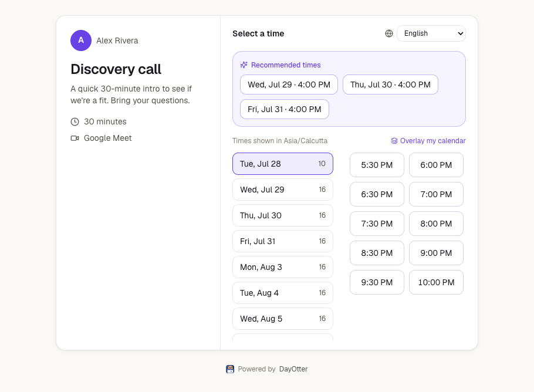

<div align="center">

# DayOtter

**Make all your calendars work as one.**
The open-source calendar & scheduling app for people juggling **multiple calendars** - connect every calendar (personal + work + clients), never get double-booked, protect your focus, and share **one booking link that respects them all**. With an AI assistant, Otter, built into the core.

**[▶ Try the hosted version](https://dayotter.com)** &nbsp;·&nbsp; [🐳 Self-host with Docker](#self-hosting-production) &nbsp;·&nbsp; [How we compare](./docs/COMPARISON.md)

<br>

<a href="https://dayotter.com"></a>

<br>

[Website](https://dayotter.com) · [Docs](./docs) · [Discord](https://discord.gg/cxwETDsY85) · [Roadmap](./docs/ROADMAP.md) · [Discussions](https://github.com/Dayotter/dayotter/discussions) · [Good first tasks](./docs/TASKS.md) · [Contributing](./CONTRIBUTING.md)


[](https://discord.gg/cxwETDsY85)
[](https://github.com/Dayotter/dayotter/discussions)
[](https://github.com/Dayotter/dayotter/stargazers)

</div>

---

## What is DayOtter?

DayOtter connects **all** your calendars - Google, Microsoft 365, Apple (CalDAV), and any ICS feed - and treats them as one. Your booking availability, your focus time, and every conflict check respect *every* calendar you own, so a personal appointment automatically blocks a work slot and you never get double-booked across accounts. On top of that: booking pages, team round-robin, reminders, and payments - with an AI assistant, **Otter**, built into the core rather than bolted on.

Most schedulers hand out a link and stop there. Otter actually does the work. You describe what you want in plain language - in the app, by voice, or over **WhatsApp / SMS** - and Otter drafts the action; you approve it. It **protects your focus time**, nudges your next meeting when you're **running late**, surfaces **proactive suggestions**, and **learns your patterns** over time. Crucially, it is **confirm-first**: it never changes your calendar without your OK.

Think Calendly + Motion + a real assistant - except **open-source and self-hostable in one command**, with every AI feature included.

### Why DayOtter

- **One link, every calendar.** Share a single booking page that's conflict-aware across all your Google / Microsoft / Apple accounts at once - not one link per calendar.
- **Genuinely open, including the AI.** AGPLv3; self-host the whole product - Otter included - for free, forever. (Calendly is closed; [Cal.com went closed-source in 2026](./docs/COMPARISON.md).)
- **The AI runs where you want it.** Local model via Ollama/vLLM for zero phone-home, or bring your own key - and it's **confirm-first**, so it never reshuffles your calendar behind your back.

> **The AI is optional and never a black box.** DayOtter runs as a complete scheduler with **no AI configured at all**. Turn Otter on by pointing it at a model *you* choose: Anthropic or OpenAI, any OpenAI-compatible endpoint, or a **local model via Ollama / LM Studio / vLLM - so nothing has to leave your server**. See [Self-hosting the AI](./docs/AI.md#self-hosting-the-ai).

**Who it's for**

- **Individuals** - a booking page and an assistant that clears the scheduling back-and-forth for you.
- **Teams** - weighted round-robin, collective availability, routing forms, and shared analytics.
- **Organisations & self-hosters** - run the entire product on your own infrastructure under AGPLv3, keep your calendar data on your servers, and roll the mobile app out to your whole team pointed at your own instance (see [Mobile app](#mobile-app-in-progress)).

## Why we're building it

Scheduling is where a lot of knowledge work quietly leaks time, and the good tools are closing up. Calendly is closed and cloud-only. **[Cal.com moved its core to a closed repo in April 2026](https://cal.com/blog/cal-diy-open-source-to-closed-source)** - citing AI - leaving only a stripped-down MIT fork with the commercial features removed. Motion and Reclaim were never open at all.

We think the assistant that reads your calendar and acts on your time is exactly the thing that should be **open, inspectable, and self-hostable** - not a black box you rent. So DayOtter stays genuinely open: **AGPLv3, self-host the _whole_ product** - including all of Otter's AI - for free, forever. Not a demo, not a stripped fork.

## Features

**Scheduling** · unlimited event types & booking pages · Google / Microsoft 365 / Apple (CalDAV) / ICS calendar sync · availability engine with buffers, notice, timezones · recurring meetings · group polls · accept payments (Stripe) · prepaid session packages

**Teams** · weighted round-robin & collective booking · routing forms · shared availability · per-seat billing

**Otter (AI)** · natural-language command bar · voice input (mobile) · **inbound WhatsApp/SMS** · **AI voice receptionist** (24/7 phone line) · focus auto-scheduling · running-late overflow alerts · **proactive suggestions** · **long-term memory** · post-meeting recap. See [`docs/AI.md`](./docs/AI.md).

**Insight** · booking analytics + "where your time goes" time-allocation · CSV export

**Platform** · multi-channel reminders (email, Slack, WhatsApp, SMS, push) · automations & workflows · API keys & webhooks · mobile app (Expo, iOS + Android)

## Mobile app

The **Android app is live on Google Play**: **[play.google.com/store/apps/details?id=com.dayotter.app](https://play.google.com/store/apps/details?id=com.dayotter.app)**. The **iOS** build (same Expo/React Native codebase in `apps/mobile`) is on the way.

It covers the day-to-day host workflow - dashboard, bookings, availability, event types, calendars, insights, reminders/channels, automations, workflows, and preferences - with voice input for Otter.

**Bring your own server - built for organisations.** The app isn't hard-wired to our cloud. It ships with a **Server** setting where anyone can point the same app at *their own* self-hosted DayOtter instance. So an organisation can:

1. Self-host DayOtter once (Docker Compose - see below).
2. Have their team install the **same** app from the store (or an internal/EAS build).
3. Each person switches the server to the org's instance and signs in - their data never leaves the org's infrastructure.

No forking, no per-org app build required. One app, any DayOtter server.

> Note: the app is pre-1.0 and evolving quickly. Android push needs a Firebase `google-services.json` to deliver remote reminders - see [`docs/TASKS.md`](./docs/TASKS.md).

## Open-core

DayOtter is **open-core**, the way Cal.com _used to be_:

- **Everything outside `ee/` is AGPLv3** - the whole product, including all of Otter's AI. Self-host it and pay nothing.
- **`ee/` is a small, separately-licensed commercial layer** for *cloud-only infrastructure* - Managed AI (no key to configure), SSO, white-label, hosted messaging. It's inert unless `DAYOTTER_CLOUD=1`. See [`apps/web/lib/ee/LICENSE.md`](./apps/web/lib/ee/LICENSE.md) and [`docs/ENTERPRISE.md`](./docs/ENTERPRISE.md).

You do **not** need `ee/` to run the full product.

**How we intend to make money — and our promise.** The plan is a hosted **DayOtter Cloud** (convenience: managed AI with no key to configure, hosted messaging, SSO, white-label) for people who don't want to run servers. That's it. The self-hostable product — booking, teams, routing, workflows, insights, payments, and all of Otter's AI logic — **stays AGPLv3 and free, forever.** We will not move the core to a closed or "source-available" repo. If that ever changes, AGPLv3 guarantees the last open version can be forked and carried on by anyone — which is the whole point.

> **Project status: early and moving fast.** DayOtter is a young project (first public code mid-2026). It's broad and usable, but it is **not yet battle-tested at scale**, and enterprise pieces (SSO/SAML, SCIM, audit logs, SOC 2 / HIPAA) are on the [roadmap](./docs/ROADMAP.md), not shipped. Kick the tires, self-host it, and help shape it - issues and PRs welcome.

## Monorepo layout

```
apps/
  web       Next.js 15 - dashboard, public booking pages, REST API, Otter
  worker    Node + BullMQ - reminders, calendar sync, briefings, scribe
  mobile    Expo (React Native) - iOS + Android
packages/
  core          availability engine, round-robin, crypto (pure, unit-tested)
  db            Drizzle schema + Postgres client
  jobs          BullMQ queue contracts (shared producer/consumer)
  calendar      Google / Microsoft / Apple adapters behind one interface
  integrations  provider OAuth + sync
  notifications multi-channel delivery (Slack, Twilio, Expo/web push)
  emails        transactional email (Resend / SMTP)
  auth          Better Auth config (email, Google, phone/OTP)
```

Full breakdown: [`docs/ARCHITECTURE.md`](./docs/ARCHITECTURE.md).

## Quick start (development)

**Prerequisites:** Node 20+, [pnpm](https://pnpm.io) 9+, and Docker (for Postgres + Redis). Everything else installs with `pnpm install`.

```bash
git clone https://github.com/Dayotter/dayotter && cd dayotter

# 1. Datastores - starts Postgres + Redis in the background
docker compose up -d

# 2. Config - copy the example and fill in what you need. It runs with sane
#    defaults; add OAuth creds + ANTHROPIC_API_KEY to enable calendar sync + Otter.
cp .env.example .env

# 3. Install deps and create the database schema
pnpm install
pnpm db:push

# 4. Run the web app (:3000) + the background worker together
pnpm dev
```

Open **http://localhost:3000**, create an account, and you have a working booking page. Integrations (Google/Microsoft calendar, Stripe, Twilio, AI) are all optional and off until you add their keys - see [`docs/INTEGRATIONS.md`](./docs/INTEGRATIONS.md).

Run the mobile app against your local server with `pnpm --filter @dayotter/mobile start` (point its **Server** setting at your machine).

**Common commands:** `pnpm dev` · `pnpm typecheck` · `pnpm test` · `pnpm check` (Biome format + lint). See [`AGENTS.md`](./AGENTS.md) for conventions.

**Stack:** TypeScript · Next.js 15 · Expo (mobile) · Postgres + Drizzle · Redis + BullMQ · Luxon · Anthropic (Otter) · Better Auth · Stripe · Twilio.

## Self-hosting (production)

**Requirements:** Docker + Docker Compose, a Postgres database, and a Redis instance (both come up in the compose stack). AI is **optional** - DayOtter is a full scheduler with no model configured; add a key or a local model to turn Otter on. **Typical first-boot: ~10 minutes** to `docker compose up` and connect a calendar; OAuth for Google/Microsoft needs client IDs (see the integrations guide).

Docker Compose brings up Postgres, Redis, migrations, web, worker, and a reverse proxy. See [`deploy/README.md`](./deploy/README.md) and [`docs/SELF_HOSTING.md`](./docs/SELF_HOSTING.md). Redeploys always run migrations via [`deploy/deploy.sh`](./deploy/deploy.sh).

**Connecting integrations** (Google, Microsoft, Apple, Salesforce, HubSpot, Zoom, Stripe, Twilio, Resend) - where to get each client ID / API key and which redirect URI & webhook to register: [`docs/INTEGRATIONS.md`](./docs/INTEGRATIONS.md), mirrored on the site at `/docs/integration-setup`.

## Community

- 💬 **[Discord](https://discord.gg/cxwETDsY85)** - real-time chat with the community and the team. Come say hi.
- 🗣️ **[Discussions](https://github.com/Dayotter/dayotter/discussions)** - ask a question (Q&A), propose an idea, or show what you built. Durable, searchable answers live here.
- 🐛 **[Issues](../../issues/new/choose)** - report a bug or request a feature.
- 🔒 **[Security policy](./SECURITY.md)** - report a vulnerability privately (don't open a public issue).
- 🤝 **[Code of conduct](./CODE_OF_CONDUCT.md)** · **[How to get help](./SUPPORT.md)**

## Contributing

We'd love your help - see [`CONTRIBUTING.md`](./CONTRIBUTING.md) for setup, conventions, and the PR flow, [`docs/TASKS.md`](./docs/TASKS.md) for ready-to-start work, and [`docs/ROADMAP.md`](./docs/ROADMAP.md) for where we're headed. Good first issues are labelled on the tracker. By contributing, you agree your changes are licensed under AGPLv3 (or the EE license for `ee/`).

## License

- **Core:** [GNU AGPLv3](./LICENSE) - free to use, self-host, modify, and share.
- **`ee/`:** [DayOtter Enterprise Edition License](./apps/web/lib/ee/LICENSE.md) - commercial, cloud-only.

© DayOtter. The AGPL covers the source code, not the DayOtter name or logo.
